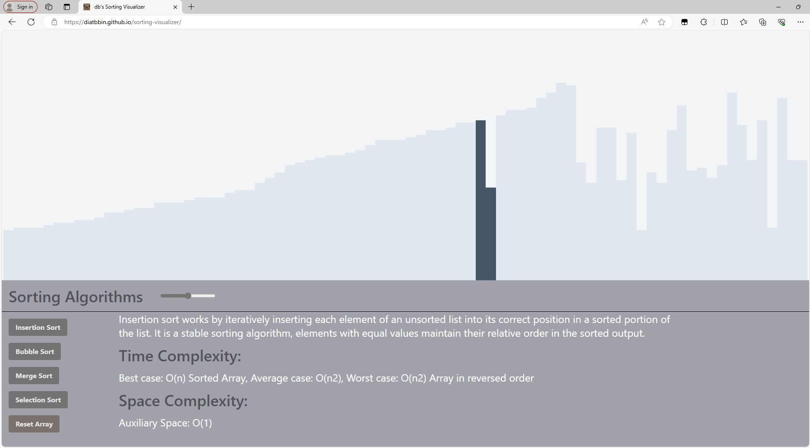

# Sorting Visualizer

This Sorting Visualizer project was built using React, Tailwind CSS and Github Actions, hosted on Github Pages.
[Click here to view the website](https://diatbbin.github.io/sorting-visualizer/).

## Purpose

This sorting visualizer serves to visually demonstrate how various sorting algorithms operate, to help programmers to quickly grasp the concepts of common sorting techniques.

Additionally, it allows me to experiment with and become familiar with the frameworks involved.
